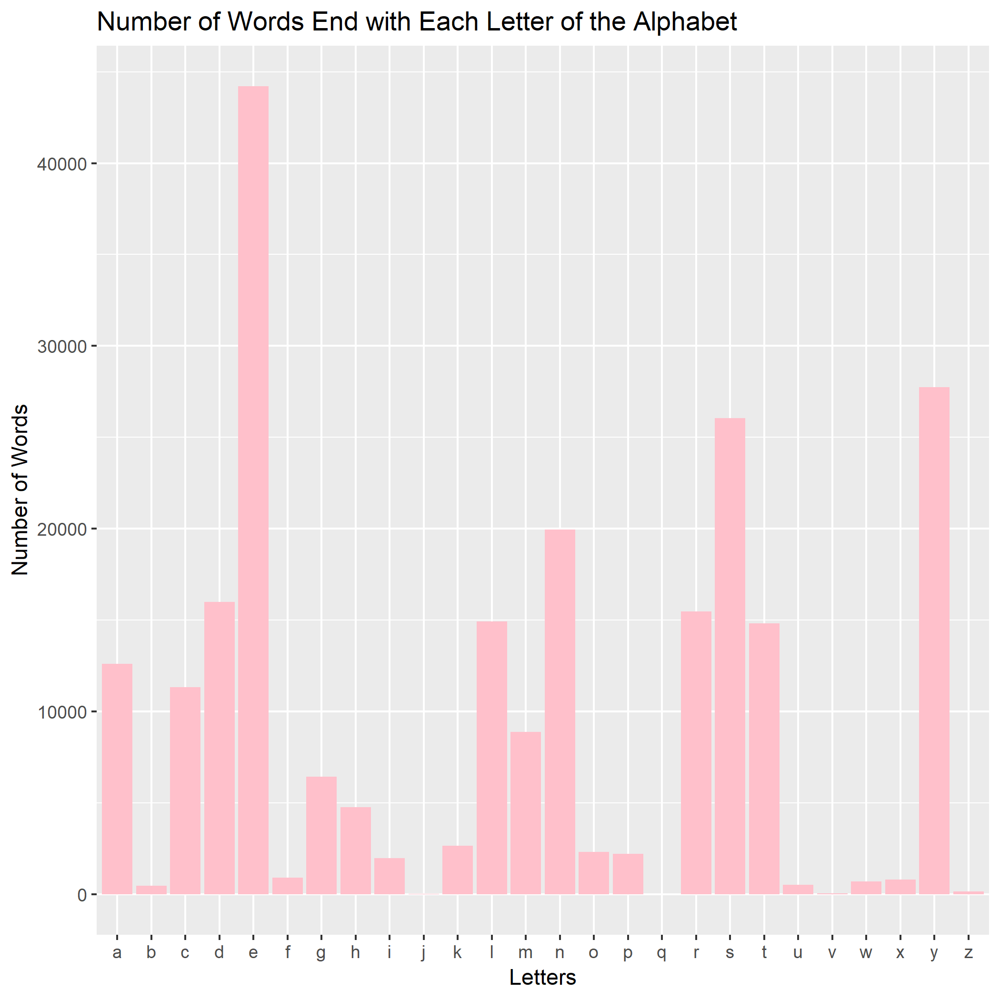
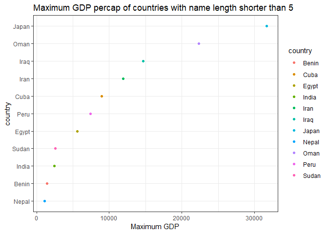

make-activity
=============
# Here is the original work from JennyBC
The commit history of this repository reflects what a student might do as she works through [this activity](http://stat545-ubc.github.io/automation04_make-activity.html) from [STAT 545](http://stat545-ubc.github.io).

Here is a histogram of word lengths.


# The following is my work for this assignment
## To make the pipeline easy to understand. I draw the following plot:
# makefile2dot
- In this assignment I used makefile2dot to make the pipe line easy to understand
The output is like this:


# In this assignment, I implement the following three functions:
* Explore the words file: count up the words according to the last character 
* Filter the words to find the words that is shorter then 5 characters. Then, filter the gapminder dataframe to leave the record whose country is in the filtered words.
* Show GDP and country from the second step using a plot. 

## Explore the words file: count up the words according to the last character 
- "endWith.r" reads `words.txt', and generates a new dataframe called 'alphabetTable'. It is used to count the words that ends with each character. After running the following code we can get the plot that we want. You can take a look in the r script [here](./endWith.r).

```r
# alphabetTable <- data.frame(letters,orig)

# Alphabetable = ggplot(alphabetTable, aes(x = letters, y = orig)) +
#   geom_bar(fill = "pink", stat = "identity") +
#   xlab("Letters") + 
#  ylab("Number of Words") + 
#  ggtitle("Number of Words End with Each Letter of the Alphabet")
```
- After running the above script, we get the following plot.



## Filter the words to find the words that is shorter then 5 characters. Then, filter the gapminder dataframe to leave the record whose country is in the filtered words.

- "findcountry.R" reads "gapminder.tsv" and "words.txt". First I filtered the words.txt to only count the words that is not longer than 5 characters, using the following r script. You can find the full rscript [here](./findcountry.R).

```r
gapminder <- read.table(file = './data/gapminder.tsv', sep = '\t', header = TRUE)


words <- readLines("./data/words.txt") %>% 
	as.data.frame()
names(words) <- c("Words")
a  = words[words$Words, ]
b = vector()

for(i in a){
	if(nchar(i)<=5){
		b = c(b,i)
	}
}
```
- Then, I try to build a dataframe by filtering 'gapminder', only leaving the the records where the country name is shorter than 5 characters. The code is as following. Also I save the dataframe as [maxGDP.rds](./data/maxGDP.rds)


```r
gapminder_by_words <- gapminder %>% 
	filter(country %in% b) %>% 
	group_by(country) %>% 
	summarise(
		max_GDP = max(gdpPercap)
	)
```

## Show GDP and country from the second step using a plot. 
- Finally, I used the following code to show the countries and GDP percapita from previous steps. You can view the r script [here](./showPic.R)

```r
# load libraries
suppressPackageStartupMessages(library(tidyverse))
suppressPackageStartupMessages(library(forcats))

# read RDS
gapminder_by_words <- readRDS("./data/maxGDP.rds")

# make plot
gapminder_by_words %>%
	# show preview of resultant levels
	ggplot(aes(x = max_GDP, y = fct_reorder(country, max_GDP, max), color = country)) + xlab("Maximum GDP") + ylab("country") +
	
	# make it a scatterplot
	geom_point() + 
	
	# add title
	labs(title = "Maximum GDP percap of countries with name length shorter than 5") +
	
	# change theme
	theme_bw()
```

<!-- -->

- This plot is saved [here](./images/maxGDP.png)

# Include python script
- In this assignment I also used python script to download and read files
- The first python file is [getGapminder.py](./getGapminder.py)
- The second python file is [getWords.py](./getWords.py)

# makefile2dot
- In this assignment I used makefile2dot to make the pipe line easy to understand
The output is like this:

